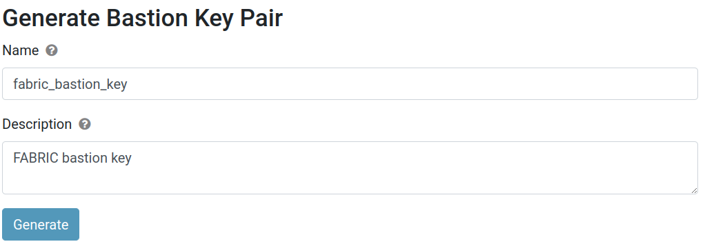

# Hello, FABRIC

In this tutorial, you will learn how to use FABRIC to run experiments in computer networks or cloud computing. It should take you about 60-90 minutes of *active* time to work through this tutorial.

> **Note** This process has multiple "human in the loop" approval stages - you'll need to wait for FABRIC staff to approve your account, and then again for your your instructor or research advisor to add you to their project. Be prepared to start the tutorial, wait for this approval, and then continue.

FABRIC is a "virtual lab" for experiments on networking, cloud computing, and distributed systems. It allows experimenters to set up real (not simulated!) hosts and links at FABRIC sites located around the United States. Experimenters can then log in to the hosts associated with their experiment and install software, run applications, and collect measurements.

Before you can run lab experiments on FABRIC, you will need to set up an account. Once you have completed the steps on this page, you will have an account that you can use for future experiments. This experiment will also demonstrate the process of "reserving" resources on a FABRIC site, logging in to a host on FABRIC, retrieving a file (such as data from an experiment) from a FABRIC host, and deleting your reserved resources to free them for other users.

## Set up your account on FABRIC

### Create an account

First, go to <https://portal.fabric-testbed.net/>. If it is your first time visiting this website, click "OK" on the bottom to accept cookies from this website. Then, click the "Sign Up" button in the top right corner.

Read the instructions on the following page, then click "Proceed".

On the following page, use the drop-down menu in the "Select an Identity Provider" box - change the setting from ORCID to your university affiliation. (If your university is not listed there, your instructor or research advisor can provide further instruction on how to log in.)

Once you have made your selection, click "Log On". You will be directed to log in using your university credentials. Then, you'll be prompted to begin setting up your FABRIC account:


Click "Begin" to continue. Next, you will be prompted to select/confirm your institution, and then you will have the opportunity to confirm or modify your personal information (name, etc.). Click "Submit" when you are ready to continue.

Within 10-15 minutes, you will receive an email in order to confirm your email address. The email will include a link (redacted in this screenshot):


Click on the link to continue setting up your account. (This email is automated, so if you don't see it in your inbox or spam folder, you may not have completed your account submission.)

To continue, you'll need to click "Accept":


### Join a project

At this stage, you have an account on FABRIC, but your account is not yet a part of any project. To use FABRIC, you need to be a part of a project that has been approved by the FABRIC staff, under the supervision of a project lead who supervises your use of FABRIC.

If you click on the "Projects" tab in the FABRIC portal dashboard (while logged in to your FABRIC account), you'll see a list of projects that you belong to. For now, you won't be part of any project! You will need to let your instructor or research advisor know that you have created your FABRIC account, and tell them the email address associated with your FABRIC account. Once they have added you to their project, you'll see it listed on that page, and you can continue with the next step.

### Open this notebook in Jupyter

Once you are part of a FABRIC project, you can reserve resources on FABRIC and access them over SSH! We'll use FABRIC's Jupyter environment for this.

Log on to the [FABRIC Portal](https://portal.fabric-testbed.net/), then click on the "JupyterHub" menu option. You may be prompted to log in again.

To continue working on this tutorial, you'll want to get the rest in "notebook" form.

In the Jupyter environment, select File \> New \> Terminal and in this terminal, run

    git clone https://github.com/teaching-on-testbeds/hello-fabric

Then, in the file browser on the left side, open the `hello-fabric` directory and then double-click on the `hello_fabric.ipynb` notebook to open it.

If you are prompted about a choice of kernel, you can accept the Python3 kernel.

Then, you can continue this tutorial by executing the cells in the notebook directly in this Jupyter environment.

### Configure your Jupyter environment

You should now be inside the Jupyter environment in FABRIC. Before you use this environment for the first time, you'll want to create some configuration files that tell it who you are, what project you belong to, and what key it should use to access your resource on FABRIC.

First, we will need to generate some keys! On FABRIC, we access the resources (hosts, switches, routers) in our experiment by connecting to a server known as a "bastion" over an SSH connection, and then connecting from the "bastion" to the device that we want to use. Both "hops" will be over SSH, a secure protocol for remote login, and both hops will use an SSH *key* for authentication. Using SSH key authentication to connect to a remote system is a more secure alternative to logging in with an account password.

SSH key authentication uses a pair of separate keys (i.e., a key pair): one "private" key, which you keep a secret, and the other "public". A key pair has a special property: any message that is encrypted with your private key can only be decrypted with your public key, and any message that is encrypted with your public key can only be decrypted with your private key.

This property can be exploited for authenticating login to a remote machine. First, the public key is uploaded to a specific location on the remote machine. Then, when you want to log in to the machine:

1.  You use a special argument with your SSH command to let your SSH application know that you are going to use a key, and the location of your private key. If the private key is protected by a passphrase, you may be prompted to enter the passphrase (this is not a password for the remote machine, though).
2.  The machine you are logging in to will ask your SSH client to "prove" that it owns the (secret) private key that matches an authorized public key. To do this, the machine will send a random message to you.
3.  Your SSH client will encrypt the random message with the private key and send it back to the remote machine.
4.  The remote machine will decrypt the message with your public key. If the decrypted message matches the message it sent you, it has "proof" that you are in possession of the private key for that key pair, and will grant you access (without using an account password on the remote machine.)

(Of course, this relies on you keeping your private key a secret.)

To access resources in our FABRIC experiments, we will use a "bastion key" to authenticate on the "hop" to the "bastion", and then a "slice key" to authenticate on the hop from the "bastion" to the FABRIC resource. In this exercise, we'll prepare both of those keys, then tell the FABRIC Jupyter environment where to find them and how to use them.

First, we will use the FABRIC Portal to generate the bastion key. In the [FABRIC Portal](https://portal.fabric-testbed.net/), log in and then click on "User Profile" in the menu bar at the top. Then, click "My SSH Keys" and "Manage SSH Keys".


Click on the "Bastion" tab, then scroll down to the "Generate Bastion Key Pair" section. Set the "Name" to `fabric_bastion_key`, exactly as shown here. You can write anything you want in the "Description" field.



Then, click "Generate".

A small pop-up will show the following message:


Click on the "Download" button next to "Private Key" and click on the "Download" button next to "Public Key" to download *both* parts of your new SSH key pair.

Find the two files, "fabric_bastion_key" and "fabric_bastion_key.pub" in your browser's regular download folder. You will need these keys - make sure to save them in a safe place!

Now, switch back to your Jupyter environment. In the sidebar on the left side of this environment is a file browser. You will see a directory named `fabric_config` there - double-click on it to navigate to this directory.


You will see that the part of the interface that shows your current position in the filesystem (highlighted in blue in the image below) changes to reflect that you are inside the `fabric_config` directory. Then, click on the upload button (highlighted in green).


Upload the two files, "fabric_bastion_key" and "fabric_bastion_key.pub", to this directory in the Jupyter environment.

You're almost ready to finish configuring your Jupyter environment now! But first, you need to find two pieces of information from the FABRIC Portal.

**Your bastion username**: In the FABRIC Portal, click on "User Profile" and then "My SSH Keys". Find the "Bastion login" (shown highlighted in the image below) and make a note of it - you can click on the small icon right next to it to copy it, then paste it somewhere else.


**Your project ID**: In the FABRIC Portal, click on "User Profile" and then "My Roles and Projects". Scroll down and find the "Project ID", then copy it.


Now you are ready! In the following cell, fill in your bastion username and project ID instead of the `...`:

``` python
%env FABRIC_BASTION_USERNAME ...
%env FABRIC_PROJECT_ID ...
```

We'll keep all of our FABRIC configuration files at the default locations, specified in the next cell:

``` python
!mkdir -p /home/fabric/work/fabric_config
%env FABRIC_BASTION_PRIVATE_KEY_LOCATION /home/fabric/work/fabric_config/fabric_bastion_key
%env FABRIC_BASTION_SSH_CONFIG_FILE /home/fabric/work/fabric_config/ssh_config
%env FABRIC_RC_FILE /home/fabric/work/fabric_config/fabric_rc
%env FABRIC_TOKEN_FILE /home/fabric/.tokens.json
%env FABRIC_SLICE_PRIVATE_KEY_FILE /home/fabric/work/fabric_config/slice_key
%env FABRIC_SLICE_PUBLIC_KEY_FILE /home/fabric/work/fabric_config/slice_key.pub
```

Now, we'll generate a new "slice key" pair. (This is used on the "hop" from the bastion, to our FABRIC resources.)

Note that this cell will appear to prompt you for a response (whether or not to overwrite the existing key pair), but a response will be sent automatically - you don't have to do anything.

``` python
!ssh-keygen -t rsa -b 3072 -f $FABRIC_SLICE_PRIVATE_KEY_FILE -q -N "" <<< y
```

and we'll make sure the file permissions are set correctly on both private keys:

``` python
%%bash
chmod 600 ${FABRIC_BASTION_PRIVATE_KEY_LOCATION}
chmod 600 ${FABRIC_SLICE_PRIVATE_KEY_FILE}
```

The following cell creates the `fabric_rc` configuration file using the values specified above. In the future, when we use FABRIC, we will load our configuration from this file.

``` python
%%bash
cat <<EOF > ${FABRIC_RC_FILE}
export FABRIC_CREDMGR_HOST=cm.fabric-testbed.net
export FABRIC_ORCHESTRATOR_HOST=orchestrator.fabric-testbed.net

export FABRIC_PROJECT_ID=${FABRIC_PROJECT_ID}
export FABRIC_TOKEN_LOCATION=${FABRIC_TOKEN_FILE}

export FABRIC_BASTION_HOST=bastion.fabric-testbed.net
export FABRIC_BASTION_USERNAME=${FABRIC_BASTION_USERNAME}

export FABRIC_BASTION_KEY_LOCATION=${FABRIC_BASTION_PRIVATE_KEY_LOCATION}
#export FABRIC_BASTION_KEY_PASSPHRASE=

export FABRIC_SLICE_PRIVATE_KEY_FILE=${FABRIC_SLICE_PRIVATE_KEY_FILE}
export FABRIC_SLICE_PUBLIC_KEY_FILE=${FABRIC_SLICE_PUBLIC_KEY_FILE} 
#export FABRIC_SLICE_PRIVATE_KEY_PASSPHRASE=

export FABRIC_LOG_FILE=${HOME}/fablib.log
export FABRIC_LOG_LEVEL=INFO 

export FABRIC_AVOID=''

export FABRIC_SSH_COMMAND_LINE="ssh -i {{ _self_.private_ssh_key_file }} -F ${HOME}/work/fabric_config/ssh_config {{ _self_.username }}@{{ _self_.management_ip }}"
EOF
```

Finally, we also create an SSH configuration file, which we'll use in the future to access our FABRIC resources using SSH.

``` python
%%bash
cat <<EOF > ${FABRIC_BASTION_SSH_CONFIG_FILE}
UserKnownHostsFile /dev/null
StrictHostKeyChecking no
ServerAliveInterval 120 

Host bastion.fabric-testbed.net
     User ${FABRIC_BASTION_USERNAME}
     ForwardAgent yes
     Hostname %h
     IdentityFile ${FABRIC_BASTION_PRIVATE_KEY_LOCATION}
     IdentitiesOnly yes

Host * !bastion.fabric-testbed.net
     ProxyJump ${FABRIC_BASTION_USERNAME}@bastion.fabric-testbed.net:22
EOF
```

## Reserve resources

In this exercise, we will reserve and use resources on FABRIC: two hosts on two different network segments, connected by a router. (Both the hosts and the router will be realized as Linux virtual machines.)

This involves several steps -

-   **Configure environment**: Now that you have configured your Jupyter environment on FABRIC, you can load it from the configuration file at the beginning of each experiment! Check the output of the following cell, and make sure it reflects your configuration (e.g. correct bastion hostname, etc.).
-   **Define configuration for this experiment**: Next, you will define the configuration of the experiment, with all of the properties of the virtual machines, network interfaces, and networks that you will request from the FABRIC infrastructure.
-   **Reserve resources**: At this stage, you are ready to reserve resources! You will construct a "slice" following the configuration you defined, and then submit it to FABRIC to build out on the physical infrastructure.
-   **Configure resources**: Also following the configuration you defined, you will configure network interfaces on the resources, install software, or do other configuration tasks that are necessary for your experiment.
-   **Draw the network topology**: We can visualize the network topology, including the names, MAC addresses, and IP addresses of each network interface, directly in this notebook.
-   **Log in to resources**: Finally, you will get the SSH login details for each of the nodes in your topology.

### Configure environment

``` python
from fabrictestbed_extensions.fablib.fablib import FablibManager as fablib_manager
fablib = fablib_manager() 
conf = fablib.show_config()
```

### Define configuration for this experiment

``` python
slice_name="hello-fabric_" + fablib.get_bastion_username()

node_conf = [
 {'name': "romeo",   'cores': 2, 'ram': 4, 'disk': 10, 'image': 'default_ubuntu_22', 'packages': ['net-tools']}, 
 {'name': "juliet",  'cores': 2, 'ram': 4, 'disk': 10, 'image': 'default_ubuntu_22', 'packages': ['net-tools']}, 
 {'name': "router",  'cores': 2, 'ram': 4, 'disk': 10, 'image': 'default_ubuntu_22', 'packages': ['net-tools']}
]
net_conf = [
 {"name": "net0", "subnet": "10.0.0.0/24", "nodes": [{"name": "romeo",   "addr": "10.0.0.2"}, {"name": "router", "addr": "10.0.0.1"}]},
 {"name": "net1", "subnet": "10.0.1.0/24", "nodes": [{"name": "juliet",   "addr": "10.0.1.2"}, {"name": "router", "addr": "10.0.1.1"}]}
]
route_conf = [
 {"addr": "10.0.1.0/24", "gw": "10.0.0.1", "nodes": ["romeo"]}, 
 {"addr": "10.0.0.0/24", "gw": "10.0.1.1", "nodes": ["juliet"]}
]
exp_conf = {'cores': sum([ n['cores'] for n in node_conf]), 'nic': sum([len(n['nodes']) for n in net_conf]) }
```

### Reserve resources

Now, we are ready to reserve resources!

First, make sure you don't already have a slice with this name:

``` python
try:
    slice = fablib.get_slice(slice_name)
    print("You already have a slice by this name!")
    print("If you previously reserved resources, skip to the 'log in to resources' section.")
except:
    print("You don't have a slice named %s yet." % slice_name)
    print("Continue to the next step to make one.")
    slice = fablib.new_slice(name=slice_name)
```

We will reserve resources for our experiment at the EDUKY site:

``` python
site_name = 'EDUKY'
fablib.show_site(site_name)
```

Then we will add hosts and network segments:

``` python
# this cell sets up the nodes
for n in node_conf:
    slice.add_node(name=n['name'], site=site_name, 
                   cores=n['cores'], 
                   ram=n['ram'], 
                   disk=n['disk'], 
                   image=n['image'])
```

``` python
# this cell sets up the network segments
for n in net_conf:
    ifaces = [slice.get_node(node["name"]).add_component(model="NIC_Basic", 
                                                 name=n["name"]).get_interfaces()[0] for node in n['nodes'] ]
    slice.add_l2network(name=n["name"], type='L2Bridge', interfaces=ifaces)
```

The following cell submits our request to the FABRIC site. The output of this cell will update automatically as the status of our request changes.

-   While it is being prepared, the "State" of the slice will appear as "Configuring".
-   When it is ready, the "State" of the slice will change to "StableOK".

You may prefer to walk away and come back in a few minutes (for simple slices) or a few tens of minutes (for more complicated slices with many resources).

``` python
slice.submit()
```

``` python
slice.get_state()
slice.wait_ssh(progress=True)
```

### Configure resources

Next, we will configure the resources so they are ready to use.

``` python
slice = fablib.get_slice(name=slice_name)
```

``` python
# install packages
# this will take a while and will run in background while you do other steps
for n in node_conf:
    if len(n['packages']):
        node = slice.get_node(n['name'])
        pkg = " ".join(n['packages'])
        node.execute_thread("sudo apt update; sudo DEBIAN_FRONTEND=noninteractive apt -y install %s" % pkg)
```

``` python
# bring interfaces up and either assign an address (if there is one) or flush address
from ipaddress import ip_address, IPv4Address, IPv4Network

for net in net_conf:
    for n in net['nodes']:
        if_name = n['name'] + '-' + net['name'] + '-p1'
        iface = slice.get_interface(if_name)
        iface.ip_link_up()
        if n['addr']:
            iface.ip_addr_add(addr=n['addr'], subnet=IPv4Network(net['subnet']))
        else:
            iface.get_node().execute("sudo ip addr flush dev %s"  % iface.get_device_name())
```

``` python
# make sure all interfaces are brought up
for iface in slice.get_interfaces():
    iface.ip_link_up()
```

``` python
# prepare a "hosts" file that has names and addresses of every node
hosts_txt = [ "%s\t%s" % ( n['addr'], n['name'] ) for net in net_conf  for n in net['nodes'] if type(n) is dict and n['addr']]
for n in slice.get_nodes():
    for h in hosts_txt:
        n.execute("echo %s | sudo tee -a /etc/hosts" % h)
```

``` python
# enable IPv4 forwarding on all nodes
for n in slice.get_nodes():
    n.execute("sudo sysctl -w net.ipv4.ip_forward=1")
```

``` python
# set up static routes
for rt in route_conf:
    for n in rt['nodes']:
        slice.get_node(name=n).ip_route_add(subnet=IPv4Network(rt['addr']), gateway=rt['gw'])
```

### Draw the network topology

The following cell will draw the network topology, for your reference. The interface name and addresses of each experiment interface will be shown on the drawing.

``` python
l2_nets = [(n.get_name(), {'color': 'lavender'}) for n in slice.get_l2networks() ]
l3_nets = [(n.get_name(), {'color': 'pink'}) for n in slice.get_l3networks() ]
hosts   =   [(n.get_name(), {'color': 'lightblue'}) for n in slice.get_nodes()]
nodes = l2_nets + l3_nets + hosts
ifaces = [iface.toDict() for iface in slice.get_interfaces()]
edges = [(iface['network'], iface['node'], 
          {'label': iface['physical_dev'] + '\n' + iface['ip_addr'] + '\n' + iface['mac']}) for iface in ifaces]
```

``` python
import networkx as nx
import matplotlib.pyplot as plt
plt.figure(figsize=(len(nodes),len(nodes)))
G = nx.Graph()
G.add_nodes_from(nodes)
G.add_edges_from(edges)
pos = nx.spring_layout(G)
nx.draw(G, pos, node_shape='s',  
        node_color=[n[1]['color'] for n in nodes], 
        node_size=[len(n[0])*400 for n in nodes],  
        with_labels=True);
nx.draw_networkx_edge_labels(G,pos,
                             edge_labels=nx.get_edge_attributes(G,'label'),
                             font_color='gray',  font_size=8, rotate=False);
```

### Log into resources

Now, we are finally ready to log in to our resources over SSH! Run the following cells, and observe the table output - you will see an SSH command for each of the resources in your topology.

``` python
import pandas as pd
pd.set_option('display.max_colwidth', None)
slice_info = [{'Name': n.get_name(), 'SSH command': n.get_ssh_command()} for n in slice.get_nodes()]
pd.DataFrame(slice_info).set_index('Name')
```

Now, you can open an SSH session on any of the resources as follows:

-   in Jupyter, from the menu bar, use File \> New \> Terminal to open a new terminal.
-   copy an SSH command from the table, and paste it into the terminal. (Note that each SSH command is a single line, even if the display wraps the text to a second line! When you copy and paste it, paste it all together.)

You can repeat this process (open several terminals) to start a session on each resource. Each terminal session will have a tab in the Jupyter environment, so that you can easily switch between them.

## Transfer files from a FABRIC host

In future experiments, we'll often want to save the results of an experiment to a file on a FABRIC host, then transfer it to our own laptop for further inspection and analysis. In this exercise, we will learn how to do that!

As described above, open an SSH session to the "romeo" host in your topology. On this host, run the following command:

    ping -c 10 10.0.1.2 | tee ping.txt

This will:

-   send a sequence of "ICMP echo" messages to the "juliet" host, which will trigger a response from "juliet"
-   save the results - which includes the round trip delay from the time when the request is sent from "romeo", to the time that the response from "juliet" is received - to a file `ping.txt`. (The results will also be displayed in the terminal output.)

Now, in this notebook, run

``` python
slice.get_node("romeo").download_file("/home/fabric/work/ping.txt", "/home/ubuntu/ping.txt")
```

In the Jupyter environment, click on the folder icon in the file browser on the left to make sure that you are located in your "Jupyter home" directory.


Then, you should see the `ping.txt` file appear in the Jupyter file browser on the left. You can now download this file from the Jupyter environment to your own laptop.

## Modify your slice lifetime

By default, your resources will be reserved for you for one day - then, they will be deleted automatically to free them for other users.

### Extend your slice

If you don't plan to finish an experiment in one day, you can extend your slice. The following cell extends your reservation for 3 days.

``` python
from datetime import datetime
from datetime import timezone
from datetime import timedelta

# Set end date to 3 days from now
end_date = (datetime.now(timezone.utc) + timedelta(days=3)).strftime("%Y-%m-%d %H:%M:%S %z")
slice.renew(end_date)
```

Confirm the new end time of your slice in the output of the following cell:

``` python
slice.update()
_ = slice.show()
```

You can extend your slice again anytime before these 3 days have elapsed, if you need more time.

### Delete your slice

When you finish your experiment, you should delete your slice! The following cells deletes all the resources in your slice, freeing them for other experimenters.

``` python
slice = fablib.get_slice(name=slice_name)
fablib.delete_slice(slice_name)
```

``` python
# slice should end up in "Dead" state
# re-run this cell until you see it in "Dead" state
slice.update()
_ = slice.show()
```

<hr>

<small>Questions about this material? Contact Fraida Fund</small>

<hr>

<small>This material is based upon work supported by the National Science Foundation under Grant No. 2231984.</small>
<small>Any opinions, findings, and conclusions or recommendations expressed in this material are those of the author(s) and do not necessarily reflect the views of the National Science Foundation.</small>

